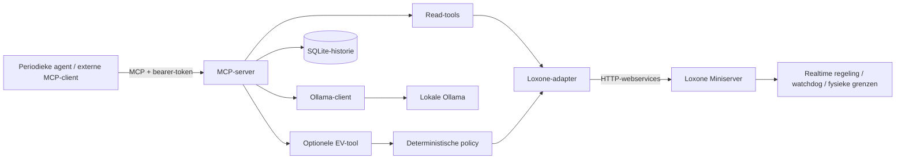

# Q-Brain — LoxBerry-plugin en lokale energie-assistent

Lokale energie-observatie en AI-advies via **MCP → Loxone** en **Ollama**.
Versie 0.2.1 voegt een **LoxBerry 4-plugin** toe met een native configuratiepagina,
servicebeheer, installatie-/upgradehooks en een bouwbaar plugin-ZIP. De bestaande
Docker-service blijft ook zelfstandig bruikbaar.

Vanaf 0.2.1 installeert het LoxBerry-pakket ook ontbrekende hostdependencies,
waaronder Docker Engine, Compose en Buildx. Upload het nieuwe ZIP als upgrade
wanneer je 0.2.0 al hebt geïnstalleerd.

**LoxBerry installeren:** volg [de LoxBerry-handleiding](docs/LOXBERRY.md).
Download [het installatie-ZIP](https://github.com/Q-Home/Q-Brain/raw/refs/heads/main/packages/qbrain-loxberry-0.2.1.zip).
Bouw het installatiepakket met `python scripts/build_loxberry.py`. Gebruik het
gegenereerde ZIP onder `dist/`, niet het GitHub-broncodearchief.

De LoxBerry-variant is altijd observe-only. De onderstaande configuratie van
optionele EV-writes geldt uitsluitend voor de zelfstandige Docker-variant.

## Wat werkt

- Echte MCP Streamable HTTP-server op `/mcp`, beveiligd met een bearer-token.
- Expliciete Loxone HTTP-webserviceadapter voor vijf configureerbare signalen.
- Lokale Ollama `/api/chat`-client met gevalideerd JSON-advies.
- Een periodieke agent die via MCP `analyze_energy` oproept; adviezen worden nooit automatisch uitgevoerd.
- SQLite-historie voor metingen, adviezen en toegestane schrijfpogingen; JSON-logging naar stdout.
- `DEMO_MODE=true` en `OBSERVE_ONLY=true` standaard. Demo gebruikt vaste fictieve meetwaarden en **echte Ollama**.
- Optionele EV-limiettool, afwezig uit MCP-discovery zolang schrijven niet expliciet is ingeschakeld.
- Liveness, dependency-readiness, timeouts, rotatie van Docker-logs en begrensde historie.

## Architectuur



MCP is de interface van deze bridge; Loxone zelf spreekt hier HTTP, geen MCP.
De server haalt voor elk advies een nieuwe snapshot op. De agent doet dat standaard
elke 300 seconden, gerekend vanaf het einde van de vorige cyclus. Bij fouten blijft
de agent draaien en probeert hij pas in de volgende cyclus opnieuw. Alleen advies
wordt herhaald; een onzekere fysieke schrijfactie wordt nooit automatisch herhaald.

## Zelfstandig starten met Docker

Vereist: Docker Engine met Compose v2 en een Linux amd64/arm64-host waarop de images
kunnen draaien. De Q-Box-hardware en beschikbare RAM zijn nog niet bekend; kies en
meet een passend lokaal model. De standaardconfiguratie gebruikt CPU-inference.

```sh
cp .env.example .env
# Genereer een token en vul de uitkomst bij MCP_TOKEN in .env in:
openssl rand -hex 32
docker compose up -d --build qbox ollama
docker compose exec ollama ollama pull qwen3:4b
docker compose up -d agent
docker compose logs -f qbox agent
```

Op Windows kan `Copy-Item .env.example .env` worden gebruikt. Een token kan ook met
Python worden gemaakt: `python -c "import secrets; print(secrets.token_hex(32))"`.
Het model downloaden vereist internet; daarna blijven de meetgegevens en inference
lokaal, zolang `OLLAMA_URL` naar de lokale Ollama verwijst. Er is geen cloudfallback.

```sh
curl http://127.0.0.1:8080/healthz
curl -H "Authorization: Bearer <jouw-token>" http://127.0.0.1:8080/readyz
```

`/healthz` controleert of de server bereikbaar is. `/readyz` controleert of een
snapshot kan worden gelezen en of het ingestelde model voorkomt in Ollama `/api/tags`;
het voert geen inference uit. HTTP 503 betekent dat een dependency niet klaar is.
Docker gebruikt liveness, zodat een ontbrekend model geen herstartlus veroorzaakt.
De agent heeft geen eigen healthcheck: controleer `agent_cycle_completed` en
`agent_cycle_failed` in de logs en de tijdstempels van adviezen in de historie.

## Verbinden via MCP

Configureer je MCP-client met transport **Streamable HTTP**, URL
`http://127.0.0.1:8080/mcp` en header `Authorization: Bearer <MCP_TOKEN>`.
Een volledige referentieclient staat in `qbox/agent.py`; deze doet de vereiste MCP
initialize-handshake voordat hij een tool oproept.

| Tool | Gedrag |
|---|---|
| `get_energy_snapshot` | Vijf actuele signalen, bron en Unix UTC-tijdstempel |
| `get_energy_history(limit=20)` | Nieuwste metingen, adviezen en audit; maximaal 100 records |
| `get_operating_mode` | Demo/observe-status, EV-write-status en sitegrens |
| `analyze_energy` | Nieuwe snapshot → Ollama → gevalideerd advies → historie; `executed=false` |
| `set_ev_power_limit(watts)` | Alleen zichtbaar na expliciete activering; gehele watts binnen sitegrens |

Er is geen tool voor willekeurige URL's, UUID's, Loxone-commando's, shell-executie
of onbeperkte writes. Een client kan mappings of veiligheidsinstellingen niet via
MCP wijzigen. Eén bearer-token geeft toegang tot alle ingeschakelde tools; gebruik
in dit MVP dus alleen vertrouwde clients. De agent zelf roept alleen de adviestool op.

## Echte Loxone-installatie aansluiten

1. Maak een afzonderlijke Loxone-gebruiker met rechten op alleen de benodigde signalen.
2. Voorzie leesbare ingangen/uitgangen voor netvermogen, PV, batterij-SOC,
   batterijvermogen en EV-vermogen. Vul hun namen of UUID's in `.env` in.
3. Zorg dat de waarden al in de afgesproken eenheden en tekens staan.
4. Stel `LOXONE_URL`, gebruikersnaam en wachtwoord in; zet `DEMO_MODE=false`.
   Houd `OBSERVE_ONLY=true` en `ENABLE_EV_WRITE=false`.
5. Hermaak de services met `docker compose up -d --force-recreate qbox agent`.
6. Controleer readiness en vergelijk snapshots met de Loxone-interface.

| Mapping | Eenheid / betekenis |
|---|---|
| `LOXONE_GRID_POWER` | W; positief = netafname, negatief = injectie |
| `LOXONE_PV_POWER` | W; niet-negatief |
| `LOXONE_BATTERY_SOC` | procent; 0–100 |
| `LOXONE_BATTERY_POWER` | W; positief = laden, negatief = ontladen |
| `LOXONE_EV_POWER` | W; niet-negatief |

De adapter gebruikt `GET /dev/sps/io/<mapping>/state`, HTTP Basic-authenticatie
en een gevalideerde XML-`LL`-response met `Code=200`. Volgens de
[Loxone-webservicedocumentatie](https://www.loxone.com/dede/kb/webservices/)
zijn statusvragen voor ingangen/uitgangen bedoeld en niet voor functieblokken.
Gebruik dus geen willekeurige UUID uit een functieblok. Automatische discovery en
WebSocket/tokenauthenticatie vallen buiten dit MVP. Controleer Basic-auth-ondersteuning
op jouw firmware; een loginfout resulteert in onbeschikbare data, nooit een authfallback.

HTTPS-certificaten worden gecontroleerd. Voor een private CA kun je een CA-bundle
in het containerimage installeren. Het uitschakelen van certificaatcontrole is niet
voorzien. Voor oudere Miniservers is HTTP alleen mogelijk met
`LOXONE_ALLOW_HTTP=true`, op een afgeschermd lokaal netwerk; Basic-credentials zijn
dan niet versleuteld. Redirects en proxy-omgevingsinstellingen worden niet gevolgd.

De vijf reads zijn geen atomaire snapshot en bevatten geen brontijdstempel van de
sensor. De timestamp markeert het begin van de poll, niet de laatste sensorupdate.
Fysieke meetkwaliteit en sensoruitvalbewaking moeten in Loxone worden afgedekt.
Alle vijf signalen zijn in real mode verplicht; één fout maakt de snapshot ongeldig.

## EV-writes bewust activeren

De eerste oplevering moet in observe-only worden gevalideerd. Voor optionele writes
voorzie je in Loxone een **dedicated analoge ingang** die een EV-vermogensplafond in W
accepteert. Nul moet laden stoppen. Loxone vertaalt dit naar geldige laadstromen/fasen,
handhaaft aansluitvermogen en gebruikersoverride, en laat het externe plafond
automatisch vervallen wanneer geen geldige vernieuwing binnenkomt.

**Die watchdog moet in Loxone zijn geïmplementeerd en getest**, inclusief een
stilgevallen container en netwerkuitval. De plugin kan bij eigen uitval niets resetten.
Stem de watchdogduur af op de write-cooldown en de vernieuwingsfrequentie van de
externe controller. De meegeleverde agent vernieuwt geen writes.

Pas daarna:

```dotenv
DEMO_MODE=false
OBSERVE_ONLY=false
ENABLE_EV_WRITE=true
LOXONE_EV_LIMIT_INPUT=QBoxEVLimitW
LOXONE_WATCHDOG_CONFIRMED=true
EV_MAX_POWER_W=11000
```

Hermaak de services. `LOXONE_WATCHDOG_CONFIRMED` is een verklaring van de installateur,
geen automatische controle. De policy vereist een nieuwe real-mode snapshot,
controleert poll-leeftijd, hele watts, sitegrens en cooldown, en schrijft de poging
naar SQLite **voor** de Loxone-aanroep. Timeouts zijn onzekere resultaten: controleer
Loxone voordat je handmatig opnieuw probeert. `accepted_by_loxone` is een API-bevestiging,
geen meting dat de laadpaal daadwerkelijk het gewenste vermogen gebruikt.
Cooldown geldt per serverproces; gebruik één replica. Na een herstart begint die
cooldown opnieuw. De lokale Loxone-regeling blijft altijd eindverantwoordelijk.

## Configuratie

Alle instellingen staan in `.env.example`; de service valideert deze bij het starten.

| Variabelen | Default / functie |
|---|---|
| `MCP_TOKEN` | Verplicht, minimaal 32 tekens; niet committen |
| `MCP_URL` | Agentendpoint; Compose gebruikt intern `http://qbox:8080/mcp` |
| `MCP_ALLOWED_HOSTS` | JSON-lijst; standaard localhost, 127.0.0.1 en qbox met willekeurige poort |
| `DEMO_MODE`, `OBSERVE_ONLY` | Beide `true` |
| `ENABLE_EV_WRITE`, `LOXONE_WATCHDOG_CONFIRMED` | Beide `false` |
| `LOXONE_URL`, `LOXONE_USERNAME`, `LOXONE_PASSWORD` | Verbinding; real mode vereist credentials |
| `LOXONE_ALLOW_HTTP` | `false`; expliciete opt-in voor ongecodeerde lokale verbinding |
| `LOXONE_*` mappings | Zie signaaltabel en optionele EV-ingang |
| `EV_MAX_POWER_W` | 11000; configureerbaar 0–22000 |
| `WRITE_COOLDOWN_SECONDS` | 60; 1–3600 |
| `SNAPSHOT_MAX_AGE_SECONDS` | 30; 1–300; ouderdom vanaf poll-start |
| `REQUEST_TIMEOUT_SECONDS` | 5; 1–30; Loxone en model-readiness |
| `OLLAMA_URL`, `OLLAMA_MODEL` | `http://ollama:11434`, `qwen3:4b` |
| `OLLAMA_TIMEOUT_SECONDS` | 120; 1–600 |
| `REASONING_INTERVAL_SECONDS` | 300; 10–86400 |
| `HISTORY_PATH`, `HISTORY_MAX_ROWS` | `/data/history.sqlite3`, 10000; gezamenlijke eventretentie |

Poort 8080 wordt alleen op de host-loopback gepubliceerd; Ollama heeft geen
gepubliceerde poort. Voor toegang van buiten de Q-Box: gebruik een beveiligde tunnel
of TLS-reverse-proxy, behoud bearer-auth en voeg de bedoelde host expliciet toe aan
`MCP_ALLOWED_HOSTS`. Publiceer dit MVP niet rechtstreeks op internet.

## Ontwikkeling en tests

```sh
python -m venv .venv
. .venv/bin/activate
pip install -r requirements-dev.lock
pip install --no-deps -e .
pytest -q
```

Windows: activeer met `.venv\Scripts\Activate.ps1`.
De integratietest start een echte HTTP-MCP-server en een lokale Ollama-fixture:
initialize, discovery, bearer-auth, read, analysis, historie en agentcyclus.
Unit-tests gebruiken gesimuleerde Loxone XML-responses en controleren blokkades,
invalid data, cooldown en onzekere writes. Geen test stuurt een echte installatie aan.

`Dockerfile` draait zonder root met alleen `/data` en `/tmp` schrijfbaar via Compose.
De Python-runtimeafhankelijkheden zijn vastgelegd in `requirements.lock`. Base-images
gebruiken tags; pin bij productie ook image-digests na validatie op jouw hardware.
Ollama-data en historie zitten in named volumes. `docker compose down` behoudt ze;
`docker compose down -v` verwijdert ze. Maak voor een consistente SQLite-back-up de
qbox-service tijdelijk stil en kopieer daarna de database uit het volume.

## Extensiepunten voor energiebeheer

- `loxone.py`: vervang HTTP-polling door authenticated WebSocket/statusstreaming,
  met expliciete meetkwaliteit en brontijdstempels; behoud dezelfde snapshotcontracten.
- `models.py`: voeg tariefvensters, PV-forecast en EV-vertrektijd toe als getypeerde data.
- `ollama.py`: adviesprompt en outputschema; modeloutput blijft onbetrouwbare invoer.
- `policy.py`: voeg deterministische optimalisatie en expliciete constraints toe.
  Batterijwrites vragen onder meer SOC-, temperatuur-, vermogens- en levensduurgrenzen.
- `server.py`: voeg één semantische tool per toegestane actie toe, met bereik,
  lokale failsafe, audit en tests; nooit een generieke write doorgeven aan het model.
- `agent.py`: planning, backoff en Q-Portal-invoer. Voeg automatische uitvoering pas
  toe met een afzonderlijk gevalideerd plan-/expirycontract en installatietests.

Geen prijsoptimalisator, voorspeller, automatische besturing of Q-Portal-koppeling
is in dit MVP inbegrepen. Zonder echte hardwaretest
is de Loxone-compatibiliteit op jouw installatie nog niet bewezen.

## Officiële referenties

- [Loxone webservices](https://www.loxone.com/dede/kb/webservices/)
- [Loxone API](https://www.loxone.com/enen/kb/api/)
- [MCP Python SDK, v1](https://github.com/modelcontextprotocol/python-sdk/tree/v1.x)
- [Ollama chat API](https://docs.ollama.com/api/chat)
- [Ollama broncode](https://github.com/ollama/ollama)
