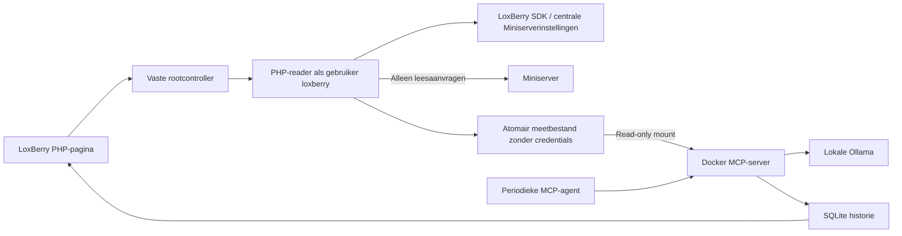

# Q-Brain voor LoxBerry 4 — versie 0.5.0

Q-Brain gebruikt de Miniserver die al in LoxBerry is ingesteld. De lokale
LoxBerry PHP SDK leest de verbinding en meetwaarden; alleen meetgegevens gaan
naar de Docker-service. Ollama maakt periodiek Nederlandstalige analyses.
Deze plugin werkt uitsluitend in observe-only: hij stuurt geen apparaten aan.

## Installeren of upgraden

1. Gebruik LoxBerry 4 op een native Debian 11–13 host met aarch64 of x86_64.
   De installer installeert ontbrekende Python 3, sudo, PHP CLI, PHP curl/XML,
   CA-certificaten, curl, Docker Engine, Compose en Buildx. Bestaande Docker-installaties
   blijven behouden. De SDK zelf wordt door LoxBerry geleverd.
2. Upload [qbrain-loxberry-0.5.0.zip](https://github.com/Q-Home/Q-Brain/raw/refs/heads/main/packages/qbrain-loxberry-0.5.0.zip)
   bij LoxBerry → Pluginbeheer. Gebruik het installatiepakket, niet GitHub Download ZIP.
3. Open Q-Brain. Eén geconfigureerde Miniserver wordt automatisch gekozen.
   Bij meerdere Miniservers kies je er één. Zonder Miniserver voeg je die eerst
   toe in de algemene LoxBerry-instellingen.
4. Klik **Start en analyseer automatisch**. Q-Brain slaat de keuze op, bouwt de
   containers, start de uitlezing en downloadt het ingestelde Ollama-model.
   De eerste build/download kan meerdere minuten duren. De pagina mag gesloten worden.
5. De pagina toont gevonden meetpunten, ontbrekende informatie en de laatste analyse.
   De agent probeert elke 300 seconden opnieuw, ook als het model bij de vorige poging
   nog niet klaar was. Model en interval staan onder Geavanceerde instellingen.

Upgrades behouden historie en modelvolumes. Een oude 0.2.x-configuratie schakelt over
naar SDK-uitlezing; bestaande losse wachtwoorden/mappings worden niet meer gebruikt.
Nieuwe wachtwoorden in LoxBerry worden bij de volgende uitlezing vanzelf overgenomen.
Een bewust ingestelde demomodus vanaf 0.3.0 blijft bij volgende upgrades behouden.
Stop behoudt alle gegevens. Na herstart van de host hervat alleen een eerder gestarte
plugin automatisch. Start controleert of het model al aanwezig is; alleen een ontbrekend model wordt
gedownload. Met een gebouwd image en aanwezig model werkt herstart en analyse lokaal zonder internet.

## Updates via LoxBerry

Vanaf 0.3.1 bevat plugin.cfg een stabiele RELEASECFG-updatebron. LoxBerry leest
release.cfg op GitHub en haalt bij een nieuwere versie het gebouwde installatie-ZIP op.
Vanaf 0.2.x of 0.3.0 is eenmalig een handmatige ZIP-upgrade nodig: die oude installaties
hebben nog geen bron om nieuwe versies te ontdekken. Verwijder de plugin niet vooraf.

Open daarna Pluginbeheer en kies bij Q-Brain **Automatic Updates → Releases**.
Gebruik **Re-Check for Updates** om opnieuw te controleren. Als je de nieuwste versie
hebt, wordt er uiteraard nog geen nieuwere update aangeboden. De keuze voor automatische
installatie wordt door LoxBerry beheerd. Er is geen apart prereleasekanaal.

Voor een volgende publicatie: verhoog plugin.cfg en de runtimeversies, bouw eerst
het overeenkomstige packages/qbrain-loxberry-VERSIE.zip, en publiceer dit samen met
release.cfg (VERSION, ARCHIVEURL en INFOURL). Behoud oudere versiearchieven. De tests
controleren versieconsistentie en de metadata van het downloadpakket.

## Automatisch zoeken: wat deze versie ondersteunt

De hostreader gebruikt `LBSystem::get_miniservers()` en `mshttp_call2()` uit de
[LoxBerry PHP SDK](https://wiki.loxberry.de/entwickler/php_develop_plugins_with_php/php_loxberry_sdk_documentation/start).
Hij leest `/data/LoxAPP3.json` en zoekt energierelevante namen, ook in subControls.
Vanaf 0.4.0 leest een begrensde WebSocket-sessie de numerieke state-UUIDs uit deze
structuur. Hiervoor is Miniserver-firmware 11.2 of nieuwer vereist. De reader gebruikt
de centrale SDK-credentials voor een kortlevend JWT met webrechten en trekt dit na
de uitlezing zo mogelijk weer in. Er worden geen apparaatcommando's verstuurd.
InfoOnlyAnalog zonder state-UUID behoudt de bestaande scalar-HTTP-reader.

| Blok | Uitlezing en analyse |
|---|---|
| Meter | Actueel vermogen via `actual`; opslaginhoud via `storage` wanneer type en eenheid bekend zijn |
| Wallbox2 | Werkelijk laadvermogen via `actual`, afzonderlijk per laadpunt |
| InfoOnlyAnalog | Numerieke waarde met expliciete eenheid; bestaande naamherkenning |
| EnergyManager2 | Gpwr, Ppwr, Spwr en Ssoc leveren globale energiewaarden met vaste eenheden |
| Slider / TextState / InfoOnlyDigital | Metadata voor context; instellingen en online-status gelden niet als energiemeting |

De formattering bepaalt de eenheid. kW wordt naar W omgerekend. Batterijopslag
in kWh blijft kWh en wordt niet zonder gevalideerde capaciteit als SOC gepresenteerd.
Meerdere laadpunten of batterijen worden afzonderlijk geanalyseerd: Q-Brain verzint
geen totaalmeter en telt mogelijk overlappende metingen niet automatisch op.
De vermogensrichting van een algemene Meter blijft onbekend zolang die niet expliciet
vastligt. Voor de globale velden behoudt Q-Brain de conservatieve naamherkenning:
PV/solar/zonne, EV/laadpaal/Wallbox2, batterij/accu/SOC met %, grid met `positive import`
en batterijvermogen met `positive charging`. Meerdere kandidaten blijven dubbelzinnig.

### Lokaal ontdekkingsmodel

Start maakt automatisch het Ollama-modelprofiel `qbrain-discovery:latest` aan op
basis van het ingestelde model, standaard `qwen3:4b`. Dit is een apart profiel met
een gerichte opdracht, geen nieuw getraind model en geen tweede kopie van de gewichten.
Het onderzoekt namen, bloktypes, ruimtes, categorieën, eenheden, state-velden en
beschikbare numerieke waarden. Het kan bijvoorbeeld Grid als kandidaat-netmeter en
Battery 1–3 als afzonderlijke batterijmeters aanwijzen, en aangeven welke informatie
nog ontbreekt. Dit werkt ook wanneer nog geen bruikbare vermogenswaarde beschikbaar is.

De pagina toont voorstellen, motivatie en ontbrekende informatie. Voorstellen worden
tegen de echte inventaris gecontroleerd; verzonnen velden en een batterij-SOC uit een
instelslider worden geweigerd. Modelvoorstellen worden niet automatisch als mapping
geactiveerd. De bestaande meetregels leveren wel direct bruikbare observaties per
apparaat aan de energieanalyse. De AI kan geen verborgen of niet-geautoriseerde
Miniservergegevens uitlezen. Er is nog geen interactieve mapping-/richtingeditor.

De inventaris bevat maximaal 100 relevante blokken; de modelcontext gebruikt de
60 eerst gerangschikte kandidaten. Ongewijzigde metadata en beschikbaarheid worden
maximaal één uur gecachet. Nieuwe meetwaarden alleen starten geen nieuwe discovery;
de energieanalyse gebruikt wel actuele waarden. Modelinference mag voor discovery
maximaal 300 seconden duren, instelbaar via DISCOVERY_TIMEOUT_SECONDS.

De reader begrenst HTTP tot 20 scalarpogingen en ongeveer 20 seconden, gevolgd door
een WebSocket-budget van 18 seconden. Daarna wacht de collector 60 seconden.
Meetgegevens ouder dan 180 seconden zijn ongeldig. Ontbrekende waarden blijven null.
Zonder bruikbare metingen verschijnt alleen de ontdekkingsanalyse; met onvolledige
metingen blijft energieadvies laag in zekerheid en zonder EV-vermogensadvies.
De eerste analyse op CPU kan meerdere minuten duren.

## Architectuur en bescherming van gegevens



De PHP-reader krijgt uitsluitend `list` of `collect` plus een Miniservernummer.
Er is geen generieke URL-, commando- of schrijffunctie voor de browser of AI.
SDK-code draait als de LoxBerry-gebruiker, niet als root. Elke uitlezing start een
nieuw PHP-proces en leest de centrale configuratie opnieuw. Credentials worden
niet teruggestuurd naar Python, Docker, de browser of AI. Labels uit de installatie
worden als tekst weergegeven. Begrensde metadata en numerieke telemetrie gaan naar
het lokale model en gelden daar als onbetrouwbare invoer; credentials en JWT gaan niet mee.

Vanaf 0.3.3 wordt het HTTPS-certificaat van de Miniserver niet gecontroleerd,
zoals gevraagd voor deze lokale installatie. Dit geldt voor zowel de SDK als
de compatibiliteitsreader en vanaf 0.4.0 ook de WebSocket-verbinding. Het centraal ingestelde HTTP/HTTPS-protocol blijft behouden.
Vanaf 0.3.2 ondersteunt Q-Brain ook LoxBerry 4.0.0: als `mshttp_call2` ontbreekt,
gebruikt een beperkte PHP-curl-reader de verbinding van `LBSystem::get_miniservers()`.
Dezelfde tijdslimieten en read-only grenzen blijven gelden.
De nieuwere SDK-functie wordt gebruikt wanneer die beschikbaar is.

De controller en PHP-reader staan onder `/usr/local/lib/qbrain/<folder>`.
Instellingen staan root-only onder `/var/lib/qbrain/<folder>`. Alleen de submap
`telemetry` wordt read-only gemount in de MCP-container; de centrale LoxBerry-config
wordt niet gemount. Containerprocessen krijgen geen Docker-socket. De webgebruiker
komt niet in de Docker-groep. Sudo laat alleen vaste beheeracties toe.
POST-acties hebben een sessiegebonden CSRF-token. MCP gebruikt een bearer-token en
is alleen op host-loopback bereikbaar. Ollama publiceert geen hostpoort.

## Status en probleemoplossing

- **Installatie gelukt, service nog niet bereikbaar:** klik Start en bekijk de
  beheerlog. Installatie alleen start op een nieuwe installatie nog geen containers.
- **Geen geldig antwoord / verbinding mislukt:** herlaad de pluginpagina en meld
  je opnieuw aan bij LoxBerry. API-aanvragen gebruiken dezelfde origin en padprefix
  als de pagina, onafhankelijk van een HTML-base-tag. Er zijn begrensde timeouts
  en leesbare foutmeldingen. De oorspronkelijke melding “Failed to fetch” is zonder
  browsernetwerklog niet aan één bewezen oorzaak toe te schrijven.
- **SDK-uitlezing mislukt in 0.3.0/0.3.1 op LoxBerry 4.0.0:** update Q-Brain naar
  0.3.2. Die versies gebruikten ten onrechte een functie uit de nieuwere SDK.
- **Pull access denied for qbrain-qbrain:** update naar 0.3.2. Q-Brain en agent
  gebruiken een lokaal gebouwd image dat niet op Docker Hub staat. De controller
  bouwt dat nu expliciet voor de start en schakelt pulls daarvoor uit.
- **SDK-fout in 0.3.2:** de melding onderscheidt Miniserverselectie, HTTP 401/403,
  TLS-certificaat, verbinding/timeout en ongeldige configuratiestructuur.
- **Overige SDK-uitleesproblemen:** controleer de geselecteerde Miniserver, accountrechten,
  bereikbaarheid en beschikbare PHP curl/XML-modules.
- **Meetpunten niet herkend:** open het overzicht met gevonden meetpunten. Controleer
  type, naam, eenheid en eventuele dubbele kandidaten; zie de ondersteuningstabel.
- **WebSocket-fout:** controleer firmware (11.2+), bereikbaarheid en visualisatierechten
  van het centraal ingestelde account. De AI kan ondertussen beschikbare metadata onderzoeken.
- **Nog geen analyse:** wacht op de modeldownload en een volgende analysecylus.
  `qwen3:4b` draait standaard op CPU; geheugen en rekentijd hangen van de host af.
- De native healthcheck wordt pas groen na een recente succesvolle analyse.
  De UI maakt onderscheid tussen een bereikbare service en beschikbare analyse.
- Back-up: bewaar de private state-map én de Docker-volumes voor historie en Ollama.
  Verwijderen van de plugin behoudt deze data, maar stopt containers en collector.

De dependencyinstaller gebruikt de officiële Docker Debian-pakketbron met eigen
signing key. Hij verwijdert geen conflicterende runtimes en herstart geen actieve
Docker-daemon. Een LoxBerry-in-Docker-host wordt niet ondersteund.

## Extensiepunten en lokaal testen

- `bin/loxberry.php`: begrensde SDK-reader; voeg block-specifieke read-only readers toe.
- `qbox/discovery.py`: semantiek, eenheden, ambiguïteit en tijdigheid.
- `qbox/ollama.py`: analyse op basis van bekende data, zonder uitvoerende tools.
- `qbox/policy.py`: deterministische grenzen voor de afzonderlijke standalonevariant.
- MCP-tool `discover_energy_signals`: inspecteer detectie en ontbrekende informatie.
- `/overview`: bearer-beveiligd, lokaal overzicht zonder netwerkoproepen naar Miniserver/Ollama.

```sh
pip install -r requirements-dev.lock
pip install --no-deps -e .
pytest -q
php -l bin/loxberry.php
python scripts/build_loxberry.py
```

Het ZIP bevat uitvoerbare LoxBerry-hooks en de samengestelde backend onder `bin/service`.
De CI controleert Python, PHP, Bash, Docker-build en pakketopbouw.

## Protocolreferenties

- [Loxone communicatieprotocol](https://www.loxone.com/wp-content/uploads/datasheets/CommunicatingWithMiniserver.pdf)
- [Loxone structuur en blokstates](https://www.loxone.com/wp-content/uploads/datasheets/StructureFile.pdf)

De WebSocket-reader is getest tegen een lokale protocolfixture met TLS, SHA1/SHA256,
fragmentatie, ping/pong en numerieke tabellen. Compatibiliteit en modelkwaliteit op
de fysieke installatie moeten na deze update nog worden bevestigd.

## EnergyManager2 vanaf 0.4.1

De gedocumenteerde veldnamen zijn Gpwr (netvermogen), Ppwr (productie), Spwr
(opslagvermogen) en Ssoc (SOC). Vermogen staat in kW, SOC in procent. Deze rollen
worden rechtstreeks herkend zonder AI of handmatige naamgeving. Gpwr is positief
bij netafname. Spwr is negatief bij laden; Q-Brain draait dat teken om voor zijn
snapshotconventie positief=laden. Zie de [officiële blokdocumentatie](https://www.loxone.com/enus/kb/energy-manager-2/).

Een EnergyManager2 heeft voorrang op naamherkenning van deelmeters. Meerdere managers
blijven dubbelzinnig. Expliciete HasSsoc=false en HasSpwr=false worden gerespecteerd.
De vier laadpunten blijven aparte observaties; er wordt geen onzekere som gemaakt.
Het overzicht toont nu ook de genormaliseerde waarde en eenheid bij gevonden signalen.

De agent start pas na het voorbereiden van beide modelprofielen. AI-ontdekking vraagt
maximaal acht voorstellen per antwoord om de uitvoer te begrenzen. Bij een fout toont
de pagina nu timeout, onbereikbare Ollama, HTTP-status of ongeldig modelantwoord,
zonder ruwe prompts of secrets te tonen. Een geslaagde modelinstallatie bewijst niet
dat inference op de host binnen de tijdslimiet lukt. De aangeleverde 0.4.0-log bevestigt
modelcreatie en telemetrie, maar bevat geen oorzaak van de mislukte AI-aanroep.

## Compacte hosts: 0.4.2

Op een NanoPi R5C is qwen3:4b een zware keuze naast LoxBerry. Probeer onder
Geavanceerd het model qwen3:0.6b en klik Start en analyseer automatisch. Het
ontdekkingsprofiel wordt dan opnieuw opgebouwd uit dit kleinere model. Bestaande
modelbestanden blijven behouden. Ook dit kleinere model moet op de echte host
worden gevalideerd; vooral bij weinig RAM is succes niet gegarandeerd.

De LoxBerry-service houdt maximaal één Ollama-model tegelijk geladen en verwerkt
één aanvraag tegelijk. Beide analysepaden gebruiken een context van 4096 tokens;
de ontdekkingscontext bevat maximaal 6000 JSON-tekens en maximaal vier voorstellen.
EnergyManager2 krijgt voorrang. De volledige inventaris blijft in de pagina staan;
de modelselectie is een subset en kan dus gegevens missen. De energietimeout is
voor LoxBerry verhoogd naar 300 seconden. Herkende geheugen- en runnerfouten worden
als vaste geschoonde meldingen getoond. Andere HTTP 500-fouten blijven ongespecificeerd.

Zie [Ollama geheugen en gelijktijdige modellen](https://docs.ollama.com/faq).

## Chat met Hollama — 0.5.0

Open de plugin en klik **Chat openen / sluiten**, vervolgens **New session**.
Stel bijvoorbeeld: “Analyseer mijn netafname” of “Wat weet je over mijn batterij?”.
Het ingestelde Ollama-model wordt automatisch gekozen; geen extra account of
serverinstelling nodig. Voor NanoPi R5C blijft qwen3:0.6b aanbevolen.

Dit is een aangepaste statische distributie van [Hollama](https://github.com/fmaclen/hollama),
ingebed achter de LoxBerry-login. Er is geen extra container of openbare Ollama-poort.
Vragen lopen via de bestaande CSRF-beveiligde plugincontroller naar een vaste,
bearer-beveiligde chatroute. Alleen tekstgesprekken worden ondersteund. Alternatieve
servers, modelbeheer vanuit Hollama, afbeeldingen en modelparameters zijn niet
beschikbaar in deze integratie. De interface gebruikt de beschikbare Hollama-talen;
Q-Brain instrueert het model om in het Nederlands te antwoorden.

Elke vraag krijgt een nieuwe energiesnapshot mee: bekende globale waarden, timestamp
en maximaal twaalf apparaatobservaties. Zonder recente data wordt dat expliciet aan
het model gemeld. De chat kent geen schrijftools, forecastdienst of verborgen historie.
De laatste zes user/assistant-berichten gaan mee (maximaal 1000 tekens per bericht);
een nieuwe vraag boven die lengte wordt geweigerd. Gesprekken worden in deze browser
bewaard en zijn dus niet automatisch op een ander toestel beschikbaar. Browseropslag
verwijderen wist ook de gespreksgeschiedenis.

Een antwoord wordt als geheel getoond zodra het klaar is. Chatvragen wachten zo nodig
op een lopende automatische analyse. Maximaal één chatvraag is tegelijk actief, met
annuleren en een maximale wachttijd. De pagina haalt korte statusupdates op, zodat
lange modelinference geen langdurig PHP-verzoek veroorzaakt. Tijdelijke serverjobs
zijn alleen in geheugen en vervallen bij herstart of opruiming. Een kleinere chat-UI
verhelpt onvoldoende modelgeheugen niet; bestaande Ollama-foutmeldingen blijven zichtbaar.

Zie [Hollama broncode en bouwinstructies](https://github.com/Q-Home/Q-Brain/blob/main/vendor/README.md).
