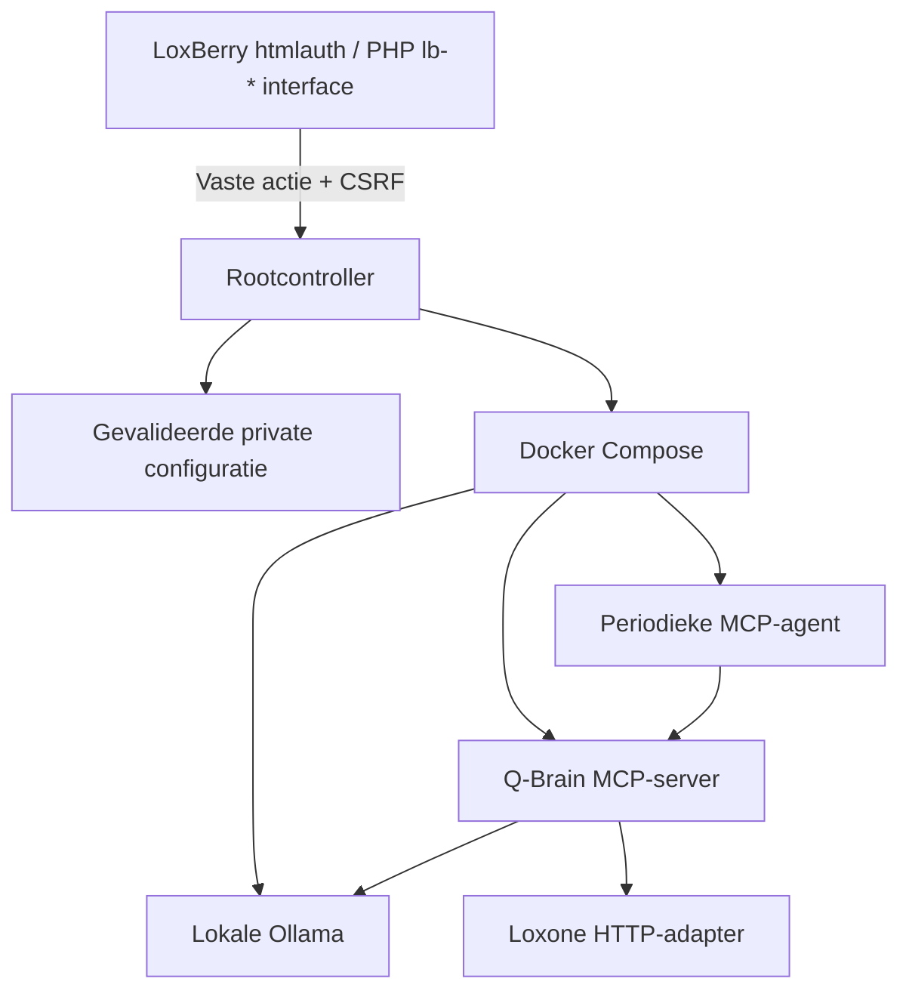

# Q-Brain als LoxBerry-plugin (0.2.0)

Q-Brain heeft nu een LoxBerry 4-pluginpakket: metadata, installatie-/upgradehooks,
een beveiligde PHP-configuratiepagina in de LoxBerry Design System-stijl,
servicebeheer, een opstart-hook en een native LoxBerry-healthcheck.
De bestaande Python MCP/Loxone/Ollama-service blijft in Docker draaien.

## Installeren

1. Gebruik **LoxBerry 4 op een 64-bit aarch64- of x86_64-host**, met Python 3.9+
   op de host en Docker Engine plus **Compose v2** in `/usr/bin/docker`.
   De host-Python heeft geen extra pip-pakketten nodig. De container gebruikt Python 3.12.
   PHP en de LoxBerry PHP-libraries worden door LoxBerry geleverd.
2. Download [qbrain-loxberry-0.2.0.zip](https://github.com/Q-Home/Q-Brain/raw/refs/heads/main/packages/qbrain-loxberry-0.2.0.zip) of bouw het zelf:

   ```sh
   python scripts/build_loxberry.py
   ```

   Dit maakt `dist/qbrain-loxberry-0.2.0.zip` met `plugin.cfg` direct in de root.
   **Gebruik niet GitHub → Download ZIP**: dat is de broncode, zonder de samengestelde
   backend in `bin/service`. De preinstall-check weigert dat archief met uitleg.
   Een succesvolle GitHub Actions-run biedt hetzelfde pluginpakket als artifact aan.

3. Upload het plugin-ZIP via **LoxBerry → Pluginbeheer** en installeer.
4. Open **Q-Brain**. De eerste installatie start nog geen services en downloadt geen model.
5. Laat de gegevensbron op **Demo**, sla de instellingen op, klik op
   **Start / pas instellingen toe** en wacht tot deze beheerbewerking klaar is.
6. Klik op **Download ingesteld AI-model**. Na het downloaden wordt de status
   gereed zodra de MCP-server en Ollama het model kunnen vinden.
7. Verbind je MCP-client of laat de periodieke agent adviseren. Daarna kun je
   echte Loxone-credentials en de vijf signaalnamen instellen, opslaan en toepassen.

Docker zelf wordt niet door deze plugin geïnstalleerd en de webgebruiker wordt niet
aan de Docker-groep toegevoegd. Een ontbrekende Docker-installatie verschijnt in de UI.
Zie de [officiële Docker-installatiehandleiding](https://docs.docker.com/engine/install/debian/)
voor de passende Debian-host. Een LoxBerry die zelf in Docker draait wordt door deze
versie niet ondersteund: er is geen Docker-in-Docker- of socket-sharingconfiguratie.

De standaard Ollama draait lokaal op CPU. Kies een model dat in het geheugen van
de Q-Box past; het standaardmodel is `qwen3:4b`. De eerste build en modeldownload
hebben internet nodig. Daarna is geen cloudservice nodig voor de energieanalyse.

## Bediening en gegevens

- **Opslaan** valideert de configuratie en bewaart die; het herstart geen containers.
- **Start / pas instellingen toe** bouwt de service en hermaakt de containers met
  de laatst opgeslagen instellingen. Een eerste build kan enkele minuten duren.
- **Stop** verwijdert alleen de containers en hun netwerk; data-volumes blijven bestaan.
- **Download ingesteld AI-model** start indien nodig alleen Ollama en downloadt het
  opgeslagen model. De modelnaam wordt als één argument doorgegeven, nooit via een shell.
- De status toont afhankelijkheden, de laatste beheerbewerking en nog niet toegepaste instellingen.
- De beheerlog bevat de laatste build/start/stop/download-uitvoer. Wachtwoorden,
  gebruikersnamen en MCP-token worden gefilterd voordat de UI de log ontvangt.
- Metingen en AI-adviezen blijven in de bestaande SQLite-historie; lees ze met
  `get_energy_history` via MCP. De pagina is een configuratie- en beheerinterface,
  nog geen energiedashboard met grafieken.

Het Loxone-wachtwoord wordt nooit teruggestuurd naar het formulier. Een leeg
wachtwoordveld bij opslaan behoudt het huidige wachtwoord. Om credentials te
verwijderen kan een beheerder de private configuratie op de host bewerken na Stop.

## Veiligheidsgrenzen

**De LoxBerry-versie is altijd observe-only.** Er zijn geen write-instellingen in
de UI. De controller weigert onbekende velden en maakt de containeromgeving zelf
met `OBSERVE_ONLY=true` en `ENABLE_EV_WRITE=false`. De optionele EV-writefunctie
van de zelfstandige Docker-variant wordt hierdoor niet ingeschakeld.

De webinterface staat alleen onder `webfrontend/htmlauth`, gebruikt POST met een
sessiegebonden CSRF-token voor wijzigingen en geeft geen secrets terug. De controller
staat buiten de webschrijfbare pluginmappen. Alleen zeven exact toegestane acties
kunnen via sudo worden aangevraagd; geen algemene Docker-, Python- of shelltoegang.
Instellingen kunnen geen Compose-bestand, volume, Docker-host of uitvoerbaar pad bepalen.
MCP blijft aan host-loopback gebonden; Ollama publiceert geen poort.

De LoxBerry-beheerder heeft uiteraard systeemrechten. Deze plugin biedt geen
isolatie tegen een beheerder die rootconfiguratie of de Docker-daemon zelf wijzigt.

## Installatiestructuur en levenscyclus



`<folder>` is de echte, door LoxBerry gekozen mapnaam, bijvoorbeeld `qbrain` of
`qbrain01`. De PHP-pagina leest die uit `$lbpconfigdir`. Installatiehooks ontvangen
hem via argument 3; de rootcontroller bewaart de installatiecontext.

| Locatie | Inhoud |
|---|---|
| LoxBerry `webfrontend/htmlauth/plugins/<folder>` | PHP-entrypoint achter LoxBerry-authenticatie |
| LoxBerry `templates/plugins/<folder>` | UI-template en helptekst |
| LoxBerry `bin/plugins/<folder>/healthcheck` | Native healthcheck met title/check-contract |
| `/usr/local/lib/qbrain/<folder>` | Root-owned controller, installatiecontext en Docker-buildbron |
| `/var/lib/qbrain/<folder>` | Private instellingen, gegenereerde Compose-configuratie en operationele status |
| `/etc/sudoers.d/qbrain-<folder>` | Exacte toegestane beheeracties |
| Docker-project `qbrain-<folder>` | Afzonderlijke containers, netwerk en volumes |

De private statusmap heeft rechten `0700`; configuratiebestanden `0600`.
Live instellingen staan bewust niet in de webschrijfbare LoxBerry-configmap, omdat
ze door een rootcontroller worden gebruikt. Neem `/var/lib/qbrain` **afzonderlijk**
mee in je back-up: een standaard LoxBerry-pluginback-up dekt dit niet automatisch.
De root-buildbron wordt bij een upgrade uit het nieuwe pluginpakket vervangen;
instellingen, MCP-token en data worden behouden.

Vóór een upgrade stopt de root-hook de oude containers. Als een beheerbewerking
nog draait, wordt de upgrade geweigerd totdat die klaar is. Na de upgrade hervat
de plugin alleen wanneer hij voordien als actief was ingesteld. De boot-hook doet
hetzelfde en blokkeert de LoxBerry-opstart niet. Na een upgrade moet een nieuwe build
slagen; controleer daarvoor de beheerlog en readiness.

Bij uninstall worden containers en sudo-regels verwijderd. Private instellingen en
Docker-data-volumes blijven behouden voor herstel. Neem eerst een back-up; verwijder
retained data daarna alleen bewust als je Q-Brain definitief wilt wissen. Een
vastgelopen Docker-daemon of lopende beheerbewerking kan opruimen verhinderen;
de uninstaller breekt dan af zodat je de plugin kunt behouden en opnieuw proberen.

## MCP verbinden en diagnose

Standaardendpoint: `http://127.0.0.1:18080/mcp` op de LoxBerry-host. De poort is
instelbaar. Een beheerder kan het gegenereerde token op de host lezen uit
`/var/lib/qbrain/<folder>/settings.json`, sleutel `mcp_token`. De UI toont het token
niet. Configureer je MCP-client met `Authorization: Bearer <token>`.
Voor toegang vanaf een andere computer: gebruik een beveiligde tunnel of TLS-proxy.

Readiness controleert een snapshot en de aanwezigheid van het model, geen volledige
AI-inference. Controleer een eerste advies met `analyze_energy` en
`get_energy_history`. De agentlog toont voltooide of mislukte analysecycli.

```sh
# Voor een installatie in de standaardmap qbrain:
sudo /usr/local/lib/qbrain/qbrain/control.py status
sudo /usr/local/lib/qbrain/qbrain/control.py logs
# Containerlogs (alleen voor een beheerder met Docker-rechten):
sudo docker compose -p qbrain-qbrain -f /var/lib/qbrain/qbrain/compose.json logs --tail 100 qbox agent
```

Gebruik de werkelijk gekozen mapnaam. Publiceer configuratiebestanden of volledige
Docker-inspect-output niet: die kunnen wachtwoorden en het MCP-token bevatten.

## Ontwikkeling en verificatie

De backend wordt bij het bouwen van het ZIP automatisch uit `qbox/` overgenomen.
Er wordt dus geen tweede Python-codekopie in de repository onderhouden.

```sh
pip install -r requirements-dev.lock
pip install --no-deps -e .
pytest -q
php -l webfrontend/htmlauth/index.php
php -l templates/index.php
bash -n preinstall.sh preroot.sh postroot.sh daemon/daemon uninstall/uninstall
python scripts/build_loxberry.py
```

De CI-workflow doet deze controles op Linux, bouwt ook het Docker-image en levert
het plugin-ZIP als downloadbaar artifact. Lokale tests gebruiken gesimuleerde
Loxone/Ollama-responses en stubben de LoxBerry PHP-libraries; ze bewijzen geen
fysieke installatiecompatibiliteit. Een eerste installatie/upgrade/uninstall op
een echte LoxBerry 4-host blijft een noodzakelijke acceptatietest.

## Gebruikte LoxBerry-referenties

- [Officieel V4-voorbeeld](https://github.com/mschlenstedt/LoxBerry-Plugin-SamplePlugin-V4)
- [V4 PHP-entrypoint](https://github.com/mschlenstedt/LoxBerry-Plugin-SamplePlugin-V4/blob/master/webfrontend/htmlauth/index.php): `LBWeb::lbheader(..., true)` en `lb-*`-componenten.
- [LoxBerry plugininstaller](https://github.com/mschlenstedt/Loxberry/blob/master/sbin/plugininstall.pl): lifecycle-argumenten, bestemmappen en ZIP-contract.
- [LoxBerry Design System](https://wiki.loxberry.de/entwickler/web_ui_development_in_loxberry/loxberry_design_system)
- [Web UI-documentatie](https://wiki.loxberry.de/entwickler/web_ui_development_in_loxberry/start)

De twee wiki-pagina's gaven bij het ophalen HTTP 403. De implementatie is daarom
gecontroleerd tegen de actuele voorbeeldcode en de plugininstaller, niet tegen de
volledige tekst van die twee wiki-pagina's.
