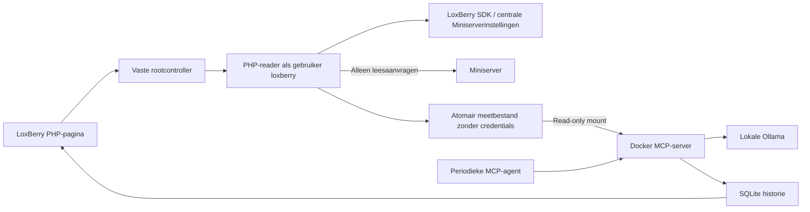

# Q-Brain voor LoxBerry 4 — versie 0.3.1

Q-Brain gebruikt de Miniserver die al in LoxBerry is ingesteld. De lokale
LoxBerry PHP SDK leest de verbinding en meetwaarden; alleen meetgegevens gaan
naar de Docker-service. Ollama maakt periodiek Nederlandstalige analyses.
Deze plugin werkt uitsluitend in observe-only: hij stuurt geen apparaten aan.

## Installeren of upgraden

1. Gebruik LoxBerry 4 op een native Debian 11–13 host met aarch64 of x86_64.
   De installer installeert ontbrekende Python 3, sudo, PHP CLI, PHP curl/XML,
   CA-certificaten, curl, Docker Engine, Compose en Buildx. Bestaande Docker-installaties
   blijven behouden. De SDK zelf wordt door LoxBerry geleverd.
2. Upload [qbrain-loxberry-0.3.1.zip](https://github.com/Q-Home/Q-Brain/raw/refs/heads/main/packages/qbrain-loxberry-0.3.1.zip)
   bij LoxBerry → Pluginbeheer. Gebruik het installatiepakket, niet GitHub Download ZIP.
3. Open Q-Brain. Eén geconfigureerde Miniserver wordt automatisch gekozen.
   Bij meerdere Miniservers kies je er één. Zonder Miniserver voeg je die eerst
   toe in de algemene LoxBerry-instellingen.
4. Klik **Start en analyseer automatisch**. Q-Brain slaat de keuze op, bouwt de
   containers, start de uitlezing en downloadt het ingestelde Ollama-model.
   De eerste build/download kan meerdere minuten duren. De pagina mag gesloten worden.
5. De pagina toont gevonden meetpunten, ontbrekende informatie en de laatste analyse.
   De agent probeert elke 300 seconden opnieuw, ook als het model bij de vorige poging
   nog niet klaar was. Model en interval staan onder Geavanceerde instellingen.

Upgrades behouden historie en modelvolumes. Een oude 0.2.x-configuratie schakelt over
naar SDK-uitlezing; bestaande losse wachtwoorden/mappings worden niet meer gebruikt.
Nieuwe wachtwoorden in LoxBerry worden bij de volgende uitlezing vanzelf overgenomen.
Een bewust ingestelde demomodus vanaf 0.3.0 blijft bij volgende upgrades behouden.
Stop behoudt alle gegevens. Na herstart van de host hervat alleen een eerder gestarte
plugin automatisch. Start controleert of het model al aanwezig is; alleen een ontbrekend model wordt
gedownload. Met een gebouwd image en aanwezig model werkt herstart en analyse lokaal zonder internet.

## Updates via LoxBerry

Vanaf 0.3.1 bevat plugin.cfg een stabiele RELEASECFG-updatebron. LoxBerry leest
release.cfg op GitHub en haalt bij een nieuwere versie het gebouwde installatie-ZIP op.
Vanaf 0.2.x of 0.3.0 is eenmalig een handmatige ZIP-upgrade nodig: die oude installaties
hebben nog geen bron om nieuwe versies te ontdekken. Verwijder de plugin niet vooraf.

Open daarna Pluginbeheer en kies bij Q-Brain **Automatic Updates → Releases**.
Gebruik **Re-Check for Updates** om opnieuw te controleren. Als je de nieuwste versie
hebt, wordt er uiteraard nog geen nieuwere update aangeboden. De keuze voor automatische
installatie wordt door LoxBerry beheerd. Er is geen apart prereleasekanaal.

Voor een volgende publicatie: verhoog plugin.cfg en de runtimeversies, bouw eerst
het overeenkomstige packages/qbrain-loxberry-VERSIE.zip, en publiceer dit samen met
release.cfg (VERSION, ARCHIVEURL en INFOURL). Behoud oudere versiearchieven. De tests
controleren versieconsistentie en de metadata van het downloadpakket.

## Automatisch zoeken: wat deze versie ondersteunt

De hostreader gebruikt `LBSystem::get_miniservers()` en `mshttp_call2()` uit de
[LoxBerry PHP SDK](https://wiki.loxberry.de/entwickler/php_develop_plugins_with_php/php_loxberry_sdk_documentation/start).
Hij leest `/data/LoxAPP3.json` en zoekt energierelevante namen, ook in subControls.
De eerste reader ondersteunt **InfoOnlyAnalog** met een via HTTP leesbare scalar.
Hij gebruikt uitsluitend `/dev/sps/io/<ontdekte UUID>/all` en de commandovrije
getter als het SDK-patroon voor analoge nulwaarden dat vereist. Een blokantwoord
met meerdere outputs wordt niet als scalar geïnterpreteerd.

| Gegeven | Herkenning |
|---|---|
| PV-vermogen | PV/solar/zonne/photovolta in naam, expliciete W of kW |
| Laadpaalvermogen | laadpaal/wallbox/EV in naam, expliciete W of kW |
| Batterijlading | batterij/accu/SOC in naam, expliciet % |
| Netvermogen | grid/netvermogen/netz met expliciet `positive import` in naam, W of kW |
| Batterijvermogen | batterij/accu met expliciet `positive charging` in naam, W of kW |

De formattering in Loxone bepaalt de eenheid, bijvoorbeeld `%.1f kW`.
kW wordt naar W omgerekend. kWh, ontbrekende eenheden, ongeldige waarden en meerdere
kandidaten worden niet stilzwijgend gebruikt. Bij net- en batterijvermogen kan
Q-Brain de tekenrichting niet uit een losse meting afleiden; daarom is daar in deze
MVP expliciete naamgeving nodig. Er is nog geen interactieve mapping-/richtingeditor.

Native Meter, EnergyManager, Fronius, Wallbox en andere samengestelde blokken worden
wel gevonden als hun naam energiegerelateerd is, maar **nog niet uitgelezen**.
Hun state-UUIDs vereisen een aparte, passende reader (bijvoorbeeld WebSocket-events);
ze worden niet blind als HTTP-ingang gebruikt. De pagina toont deze beperking.
Automatische ontdekking is dus geen garantie dat elke bestaande installatie al
zonder aanpassing meetgegevens oplevert. De huidige implementatie is getest met
SDK- en Miniserverfixtures; de uitlezing op jouw concrete installatie moet nog
worden bevestigd.

Per cyclus zijn maximaal 100 kandidaten en 20 scalar-leespogingen toegestaan,
met een netwerkbudget van ongeveer 20 seconden en 3 seconden per aanvraag.
De volledige collectie draait elke circa 60–85 seconden. Meetgegevens ouder dan
180 seconden zijn ongeldig. Ontbrekende velden blijven `null`, nooit nul.
Zonder één bruikbaar meetpunt wordt geen energieadvies gemaakt. Bij onvolledige
gegevens is de advieszekerheid altijd laag en wordt geen EV-vermogensadvies gegeven.
Zonder prijzen, voorspellingen en planning worden geen optimale besparingen beloofd.

## Architectuur en bescherming van gegevens



De PHP-reader krijgt uitsluitend `list` of `collect` plus een Miniservernummer.
Er is geen generieke URL-, commando- of schrijffunctie voor de browser of AI.
SDK-code draait als de LoxBerry-gebruiker, niet als root. Elke uitlezing start een
nieuw PHP-proces en leest de centrale configuratie opnieuw. Credentials worden
niet teruggestuurd naar Python, Docker, de browser of AI. Labels uit de installatie
worden als tekst weergegeven; alleen numerieke telemetrie gaat naar het model.

HTTPS-certificaten worden gecontroleerd. HTTP wordt alleen gebruikt wanneer die
verbinding centraal in LoxBerry zo is ingesteld. Bij een zelfondertekend certificaat
moet de host dat certificaat vertrouwen; de plugin schakelt verificatie niet uit.
De SDK moet `mshttp_call2` aanbieden. Update LoxBerry als deze ontbreekt.

De controller en PHP-reader staan onder `/usr/local/lib/qbrain/<folder>`.
Instellingen staan root-only onder `/var/lib/qbrain/<folder>`. Alleen de submap
`telemetry` wordt read-only gemount in de MCP-container; de centrale LoxBerry-config
wordt niet gemount. Containerprocessen krijgen geen Docker-socket. De webgebruiker
komt niet in de Docker-groep. Sudo laat alleen vaste beheeracties toe.
POST-acties hebben een sessiegebonden CSRF-token. MCP gebruikt een bearer-token en
is alleen op host-loopback bereikbaar. Ollama publiceert geen hostpoort.

## Status en probleemoplossing

- **Installatie gelukt, service nog niet bereikbaar:** klik Start en bekijk de
  beheerlog. Installatie alleen start op een nieuwe installatie nog geen containers.
- **Geen geldig antwoord / verbinding mislukt:** herlaad de pluginpagina en meld
  je opnieuw aan bij LoxBerry. API-aanvragen gebruiken dezelfde origin en padprefix
  als de pagina, onafhankelijk van een HTML-base-tag. Er zijn begrensde timeouts
  en leesbare foutmeldingen. De oorspronkelijke melding “Failed to fetch” is zonder
  browsernetwerklog niet aan één bewezen oorzaak toe te schrijven.
- **SDK-uitlezing mislukt:** controleer de geselecteerde Miniserver, accountrechten,
  bereikbaarheid, certificaatvertrouwen en beschikbare PHP curl/XML-modules.
- **Meetpunten niet herkend:** open het overzicht met gevonden meetpunten. Controleer
  type, naam, eenheid en eventuele dubbele kandidaten; zie de ondersteuningstabel.
- **Nog geen analyse:** wacht op de modeldownload en een volgende analysecylus.
  `qwen3:4b` draait standaard op CPU; geheugen en rekentijd hangen van de host af.
- De native healthcheck wordt pas groen na een recente succesvolle analyse.
  De UI maakt onderscheid tussen een bereikbare service en beschikbare analyse.
- Back-up: bewaar de private state-map én de Docker-volumes voor historie en Ollama.
  Verwijderen van de plugin behoudt deze data, maar stopt containers en collector.

De dependencyinstaller gebruikt de officiële Docker Debian-pakketbron met eigen
signing key. Hij verwijdert geen conflicterende runtimes en herstart geen actieve
Docker-daemon. Een LoxBerry-in-Docker-host wordt niet ondersteund.

## Extensiepunten en lokaal testen

- `bin/loxberry.php`: begrensde SDK-reader; voeg block-specifieke read-only readers toe.
- `qbox/discovery.py`: semantiek, eenheden, ambiguïteit en tijdigheid.
- `qbox/ollama.py`: analyse op basis van bekende data, zonder uitvoerende tools.
- `qbox/policy.py`: deterministische grenzen voor de afzonderlijke standalonevariant.
- MCP-tool `discover_energy_signals`: inspecteer detectie en ontbrekende informatie.
- `/overview`: bearer-beveiligd, lokaal overzicht zonder netwerkoproepen naar Miniserver/Ollama.

```sh
pip install -r requirements-dev.lock
pip install --no-deps -e .
pytest -q
php -l bin/loxberry.php
python scripts/build_loxberry.py
```

Het ZIP bevat uitvoerbare LoxBerry-hooks en de samengestelde backend onder `bin/service`.
De CI controleert Python, PHP, Bash, Docker-build en pakketopbouw.
